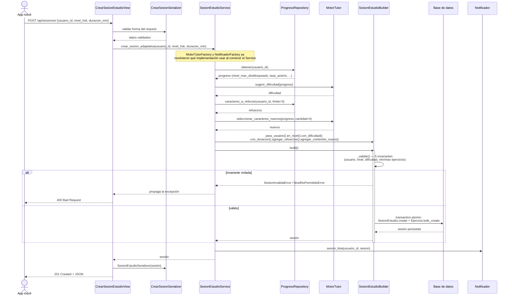

# Wiki Técnica — HanZi Mentor

Documentación pedida por la rúbrica de la Entrega 1: justificación de la
estructura de carpetas, diagrama de secuencia de la funcionalidad más
compleja, y estrategia de API Gateway.

---

## 1. Justificación de la estructura de carpetas

```
HanZi-Mentor/
├── services/
│   ├── usuarios/          # Django — cuentas, autenticación, suscripciones
│   ├── contenido/         # Django — caracteres, trazos, lecciones, vocabulario
│   └── agente-tutor/      # Django — agente IA, progreso, curva de olvido
├── gateway/               # placeholder de un gateway a medida (ver sección 3)
├── infra/nginx/           # implementación real del gateway
├── frontend/              # React + Vite (PWA mobile-first)
├── shared/                # eventos, esquemas y utilidades compartidas
└── docs/                  # arquitectura, diagramas, entregas
```

### Por qué microservicios y no un monolito

Los tres dominios tienen ritmos de cambio y patrones de carga completamente
distintos:

- **`contenido`** es casi de solo lectura: los 9.574 caracteres con sus
  trazos no cambian una vez cargados. El tráfico que recibe es alto (cada
  ejercicio pide un carácter) pero barato de resolver.
- **`agente-tutor`** es lo opuesto: escribe todo el tiempo (cada respuesta
  actualiza progreso, agenda repasos) y es donde vive la lógica que más va
  a iterar durante el curso.
- **`usuarios`** maneja datos sensibles (cuentas, pagos) que conviene poder
  aislar con sus propias reglas de acceso y, a futuro, cifrado o
  cumplimiento distinto al de los otros dos.

Meterlos en un solo Django monolítico obligaría a desplegar y migrar los
tres juntos aunque solo cambie uno, y a escalar los tres por igual aunque
`contenido` reciba diez veces más lectura que `usuarios`. Separarlos deja
que cada uno escale, se despliegue y se versione de forma independiente —
relevante en una app mobile-first donde el cliente en el celular es
sensible a la latencia de lectura de contenido, pero tolera que `usuarios`
sea más lento.

Cada servicio es un proyecto Django independiente con su **propio
entorno virtual y su propia base de datos**: evita que una migración de
un dominio bloquee a otro, y permite que cada servicio fije sus propias
versiones de dependencias sin arrastrar conflictos entre los tres.

### Por qué `domain/` e `infra/` dentro de cada app

Dentro de `agente-tutor/tutor/` (y equivalentes) hay una separación
deliberada en dos carpetas:

- **`domain/`** — reglas de negocio puras: `builders.py` (Builder de
  `SesionEstudio`), `exceptions.py`, `repaso.py`, `progreso_logic.py`,
  `sesion_logic.py`. Ninguno de estos archivos sabe qué motor de IA, qué
  notificador o qué catálogo se está usando en runtime; solo trabajan con
  los datos que reciben.
- **`infra/`** — adaptadores hacia lo externo: `factories.py`,
  `motores.py`, `notificadores.py`, `catalogo.py`. Acá sí se decide, según
  variable de entorno, si el motor es el mock o LangGraph, si el
  notificador manda un correo real o solo loggea, si el catálogo es local
  o le pega al servicio `contenido`.

Esta separación es lo que hace posible el **Principio de Inversión de
Dependencias**: `services.py` (la capa de aplicación) solo conoce las
interfaces (`MotorTutor`, `Notificador`, `Catalogo`), nunca la
implementación concreta — eso lo resuelven las Factories de `infra/`. Es
también lo que permite que `tutor/tests.py` pruebe `SesionEstudioService`
completo sin tocar LangGraph ni mandar un correo real: en los tests se
inyectan dobles que cumplen la misma interfaz.

### Por qué `gateway/` e `infra/nginx/` por separado

`gateway/` se dejó desde el diseño inicial como carpeta para un gateway a
medida (`config/`, `routes/`, `middleware/` — la forma típica de un
gateway en código, tipo Express). Para esta entrega se decidió en cambio
usar **nginx**, que resuelve el mismo problema (ruteo por prefijo,
terminación TLS) con configuración declarativa y sin mantener código
propio. La implementación real vive en `infra/nginx/nginx.conf`;
`gateway/README.md` documenta esa decisión para que no queden dos lugares
contradictorios en el repo. Ver sección 3 para el detalle.

### `shared/`

Eventos, esquemas y utilidades que más de un servicio necesita (por
ejemplo, el formato de un evento de dominio si en el futuro se agrega un
bus de mensajes entre servicios) viven acá para no duplicarlos ni generar
que dos servicios se importen código directamente entre sí — el
acoplamiento entre microservicios debería pasar siempre por su API HTTP,
nunca por un `import` cruzado.

---

## 2. Diagrama de secuencia — crear sesión adaptativa

Es la funcionalidad más compleja del sistema: combina el Builder, dos
Factories, el repositorio de progreso y el motor de tutoría en un solo
flujo transaccional.



Puntos a resaltar de este flujo:

- **La sesión nunca se persiste a medias.** `_validar()` corre antes de
  tocar la base, y `build()` está envuelto en `@transaction.atomic`: si
  algo falla a mitad de la creación de ejercicios, se revierte todo.
- **`SesionEstudioService` no sabe qué motor ni qué notificador está
  usando** — solo conoce las interfaces `MotorTutor` y `Notificador`. Las
  Factories decidieron la implementación concreta al construir el
  servicio, según las variables de entorno `TUTOR_ENGINE` y
  `NOTIFICADOR`.
- **La vista (`CrearSesionEstudioView`) no contiene ninguna regla de
  negocio**: valida la forma con el serializer, delega al servicio, y
  traduce `DominioError` a HTTP 400. Todo lo demás pasa en la capa de
  aplicación y de dominio.

---

## 3. Estrategia de API Gateway

### El problema

Hasta antes de esta entrega, el frontend (una PWA mobile-first) le pegaba
directo a tres puertos distintos:

```
usuarios      → localhost:8001
contenido     → localhost:8002
agente-tutor  → localhost:8003
```

Esto funciona en desarrollo local, pero no escala a producción:

- No hay un único dominio/puerto al que apuntar desde el cliente móvil —
  cualquier cambio de infraestructura (mover un servicio, agregar una
  réplica) rompe la app instalada en el celular del usuario.
- Cada servicio tiene que resolver CORS por separado (hoy los tres
  repiten la misma configuración en `settings.py`).
- No hay un lugar central para terminar TLS, autenticar el request antes
  de que llegue a cualquier servicio, o aplicar rate limiting — cada
  servicio tendría que reimplementar lo mismo tres veces.

Para un cliente mobile-first esto pesa más que en un cliente de
escritorio: la conexión es más inestable, la batería y la señal importan,
y cada certificado/dominio adicional que el cliente tiene que manejar es
una fuente más de fallos silenciosos en campo.

### La solución implementada

Un proxy reverso con **nginx** en [`infra/nginx/nginx.conf`](infra/nginx/nginx.conf),
que expone un único puerto (8080 en local) y rutea por prefijo de URL al
servicio dueño de ese recurso:

| Prefijo | Servicio destino |
|---|---|
| `/api/sesiones/`, `/api/ejercicios/`, `/api/progreso/` | `agente-tutor` (8003) |
| `/api/caracteres/`, `/api/lecciones/` | `contenido` (8002) |
| `/api/usuarios/`, `/api/suscripciones/` | `usuarios` (8001) — reservado para cuando existan |

El cliente móvil ya no necesita saber que existen tres servicios Django:
para él, la API es una sola. Internamente, nginx reenvía cada request al
upstream correcto y agrega las cabeceras (`X-Real-IP`,
`X-Forwarded-For`, `X-Forwarded-Proto`) que cada servicio necesita para
saber quién preguntó realmente, ya que ahora quien conecta directamente
es el gateway.

### Por qué nginx y no un gateway a medida

La carpeta `gateway/` había quedado reservada para un gateway propio en
código (`config/`, `routes/`, `middleware/` — el patrón típico de un
gateway en Express o similar). Se descartó esa opción para esta entrega
porque el problema a resolver — ruteo por prefijo y, a futuro, terminación
TLS — es exactamente lo que nginx resuelve con configuración declarativa,
sin mantener código adicional ni introducir un cuarto servicio con sus
propias dependencias y bugs. `gateway/README.md` deja esa decisión por
escrito, y esa carpeta queda como el lugar natural si en el futuro hace
falta lógica que nginx no cubra bien (por ejemplo, reglas de
autorización complejas por tipo de usuario).

### Qué queda para producción (fuera del alcance de esta entrega)

La rúbrica pide dejar el sistema *preparado* para un gateway, no un
gateway productivo completo. Lo que falta para llevar esto a producción,
y que el gateway actual ya deja listo para agregar sin tocar los
microservicios:

- **Terminación SSL** en el bloque `server` de nginx.
- **Autenticación centralizada**: validar el JWT una sola vez en el
  gateway (por ejemplo con `auth_request` de nginx contra el futuro
  servicio `usuarios`) en vez de que cada servicio lo revalide por su
  cuenta.
- **Rate limiting** por IP o por usuario con el módulo `limit_req` de
  nginx, para proteger sobre todo a `agente-tutor` (el servicio que
  invoca al modelo de IA).
